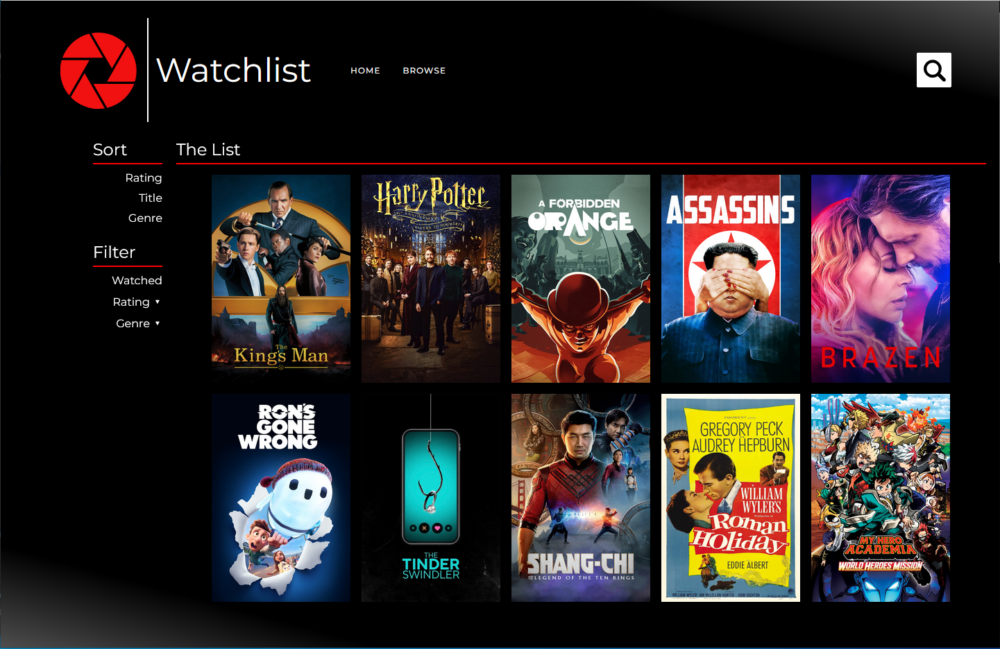
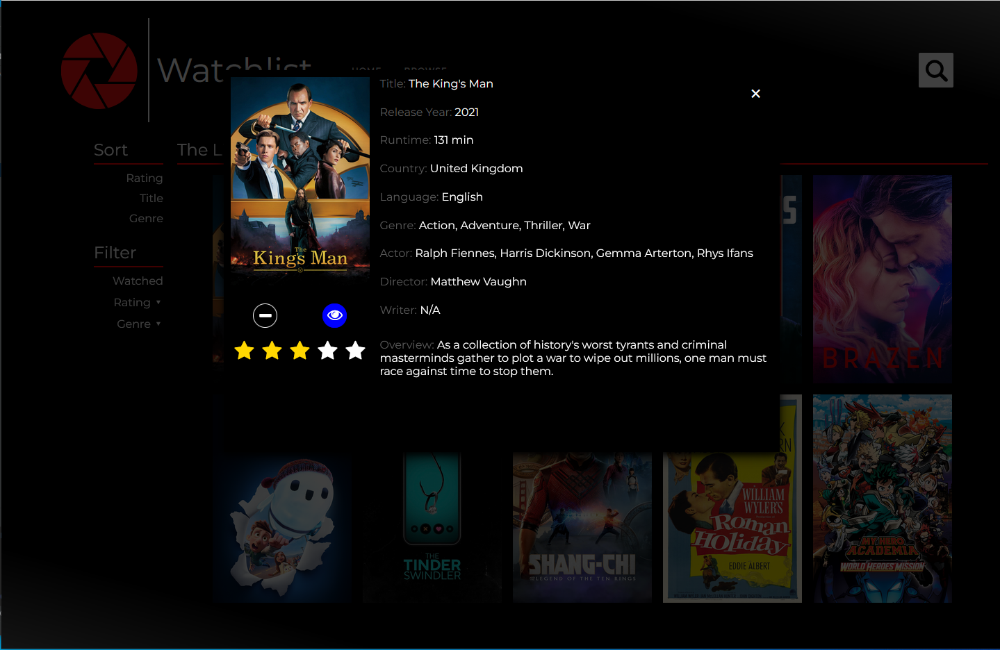
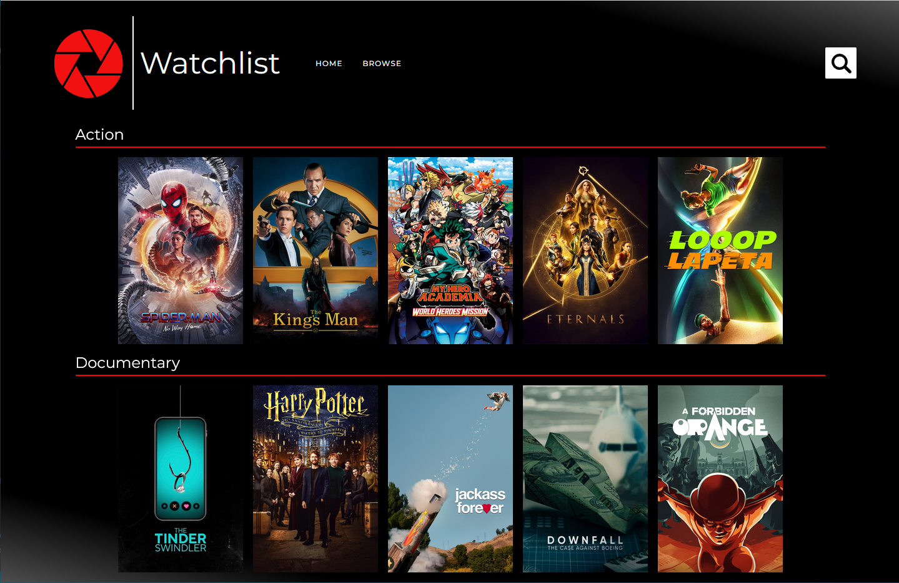
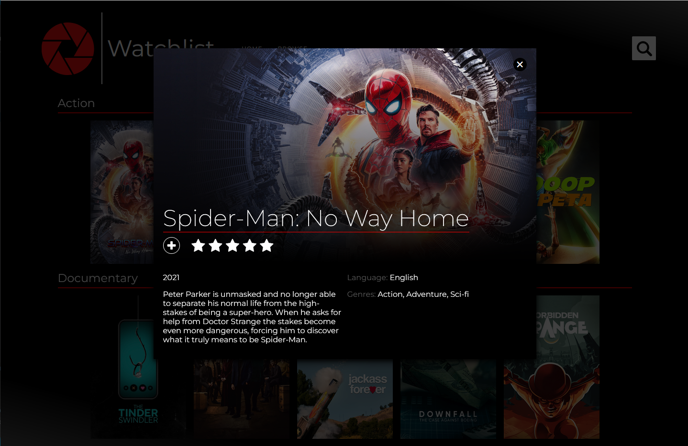
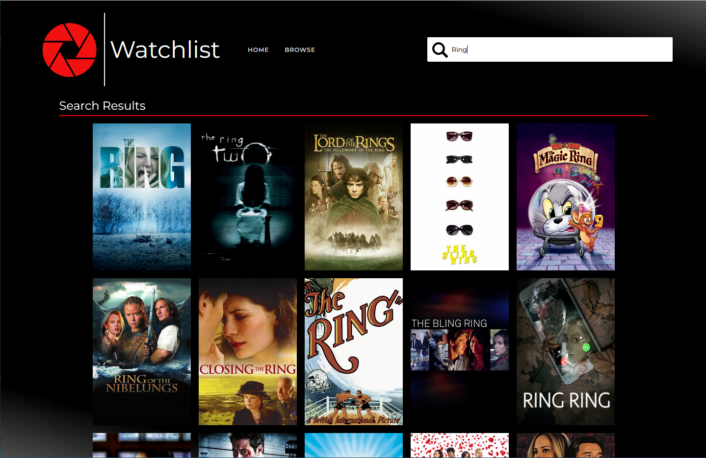

# 
The Movie Project

## Summary

---

**The Movie Project** provides a way for users to build a personalized movie watchlist. The web application allows browsing by genre of the most recently popular movies or searching by title. In addition, users can track their personal ratings as well as already watched films. This was done with the use of HTML5, CSS, Ajax, and The Movie Database (TMDB) API.

## Home

---

**The Home Page** for the web application is the user personal movie listling. Here a user can sort movies by title, rating, and genre. I addition, movies can be filter by rating or genre. Or, if the user only wants to see movies that have already been watched, by a "watched" filter. Bookmarked movies can also be edited. Once selected, a dropdown modal will appear that allows users to mark a new rating for a movie, to mark a movie as watched, or to delete a movie from the list.

Home Page

Edit Movie Modal

## Browse

---

**The Browse Page** displays several carousels of the most recently popular movies for the user to look through and add to their list to watch later. Upon selecting a movie poster, the user can choose to add a movie and/or rate their inter*est in watching.

Browse Page

Add Movie Modal

## Search

---

**The Search Page** displays when the search bar at the top is clicked. here a user can attempt to search for a movie by title. If no results are found an error message is returned.

Search Page

## External Dependencies

---

**The Movie Database (TMDB) API**: https://www.themoviedb.org/documentation/api?language=en-US

## Background

---

The above project was an assignment given by the CodeUp Full Stack Web Developers Course. This course is a fully-immersive, project-based, and intensive 22-week Full-Stack Java Career Accelerator that provides students with 670 hours of expert instruction in software development: https://codeup.com/program/full-stack-web-development/

### Application Minimum Requirements:

#### On Load:

- Display a "loading..." message
- Make an AJAX request to get a listing of all the movies
- When the initial AJAX request comes back, remove the "loading..." message and replace it with HTML generated from the json response your code receives

#### On Add:

- Create a form for adding a new movie that has fields for the movie's title and rating
- When the form is submitted, the page should not reload / refresh, instead, your javascript should make a POST request to /movies with the information the user put into the form

##### On Edit:

- Give users the option to edit an existing movie
- A form should be pre-populated with the selected movie's details
- Like creating a movie, this should not involve any page reloads, instead your javascript code should make an ajax request when the form is submitted.

###### On Delete:

- Each movie should have a "delete" button
- When this button is clicked, your javascript should send a DELETE request
